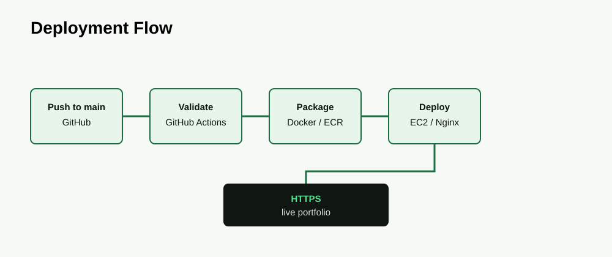

# Nagendra Jadon — DevOps Portfolio

> **DevOps Engineer · AWS · CI/CD · Linux · Infrastructure**

A production-oriented personal portfolio for Nagendra Jadon. The website is intentionally designed as both a professional portfolio and a small DevOps demonstration: source-controlled content, responsive React UI, Docker packaging, GitHub Actions validation/builds, deployment documentation, and infrastructure diagrams.

## Status

**Website implementation:** Ready for local development and production build.

**AWS/ECR/EC2 deployment:** Planned configuration. The GitHub Actions workflow currently validates and builds the application and Docker image; AWS deployment steps remain disabled until the target AWS account, ECR repository, IAM role, and EC2 environment are configured.

## Highlights

- DevOps-first positioning
- Linux-inspired dark UI with green engineering accents
- Responsive React/Vite interface
- Framer Motion interactions with reduced-motion support
- Real professional experience and sanitized client case studies
- Architecture and CI/CD diagrams
- Docker production image
- GitHub Actions build pipeline
- Example Nginx configuration
- Environment variable template
- Security and deployment documentation

## Tech Stack

- React
- Vite
- Framer Motion
- Lucide React
- CSS
- Docker
- Nginx
- GitHub Actions

## Portfolio Content

### LMS Cloud Infrastructure & Deployment

Client case study: AWS infrastructure and deployment work covering EC2, Linux, Nginx/Apache, React, Moodle, S3, and CloudFront.

[View case study](https://github.com/JustARandomCoder18/lms-cloud-infrastructure-case-study)

### Coupon Backend Deployment & CI/CD

Client case study: Hostinger VPS backend deployment using Linux, Node.js, PM2, Nginx, Git/GitHub, Jenkins, DNS/domain configuration, and HTTPS.

[View case study](https://github.com/JustARandomCoder18/coupon-backend-cicd-deployment)

### DevOps Deployment Pipeline

Personal DevOps project covering Docker, Jenkins, Terraform, AWS EC2, Prometheus, and Grafana as documented in the candidate resume.

## Repository Structure

```text
.
├── .github/workflows/deploy.yml
├── architecture/
├── deploy/nginx/portfolio.conf.example
├── docs/
├── public/assets/
├── screenshots/
├── src/
│   ├── components/
│   ├── data/
│   ├── hooks/
│   ├── lib/
│   └── sections/
├── .dockerignore
├── .env.example
├── .gitignore
├── Dockerfile
├── index.html
├── package.json
└── vite.config.js
```

## Local Development

Requirements: Node.js 22+ and npm.

```bash
npm install
npm run dev
```

Open the local Vite URL shown in the terminal.

## Production Build

```bash
npm run build
npm run preview
```

## Docker

Build and run locally:

```bash
docker build -t nagendra-devops-portfolio .
docker run --rm -p 8080:80 nagendra-devops-portfolio
```

Then open `http://localhost:8080`.

## CI/CD

The GitHub Actions workflow at `.github/workflows/deploy.yml` currently:

1. Checks out the repository.
2. Installs Node.js dependencies.
3. Runs the production build.
4. Builds the Docker image.

The intended production path is:

```text
GitHub
   ↓
GitHub Actions
   ↓
Docker Build
   ↓
Amazon ECR
   ↓
AWS EC2
   ↓
Docker Container
   ↓
Nginx
   ↓
HTTPS
   ↓
Portfolio
```

AWS deployment is intentionally documented as planned until it is actually configured and tested.

## Environment Variables

Copy `.env.example` to `.env` for local customization. Never commit secrets.

```text
VITE_SITE_URL=
VITE_LINKEDIN_URL=
VITE_CONTACT_EMAIL=
```

## Architecture




## Nginx

An example SPA/static-site configuration is available at:

`deploy/nginx/portfolio.conf.example`

Replace the example hostname before production use and add TLS configuration through the selected certificate/HTTPS setup.

## Architecture Assets

- `architecture/portfolio-architecture.svg` — portfolio runtime path
- `architecture/deployment-flow.svg` — deployment sequence
- `architecture/cicd-flow.svg` — CI/CD sequence
- `architecture/lms-architecture.svg` — LMS case-study view
- `architecture/coupon-cicd.svg` — Coupon Jenkins case-study view
- `architecture/devops-pipeline.svg` — personal DevOps pipeline view

## Documentation

- [Architecture](docs/architecture.md)
- [Deployment](docs/deployment.md)
- [CI/CD](docs/ci-cd.md)
- [Local development](docs/local-development.md)
- [Security](docs/security.md)
- [Project case studies](docs/project-case-studies.md)
- [Screenshot checklist](docs/screenshots.md)

## Security & Confidentiality

This repository contains no client source code, credentials, private IP addresses, SSH keys, internal endpoints, or proprietary deployment configuration. Client projects are presented as sanitized public case studies.

See [docs/security.md](docs/security.md).

## Engineering Decisions

- **React + Vite:** lightweight component-based frontend with fast development/build tooling.
- **CSS-first design:** the visual system stays easy to inspect and modify without an unnecessary UI framework.
- **Docker + Nginx:** repeatable production packaging and efficient static delivery.
- **GitHub Actions:** automated validation/build workflow close to the source repository.
- **ECR + EC2:** planned AWS runtime that is appropriate for a small personal portfolio without introducing Kubernetes complexity.

## Contact

- GitHub: https://github.com/JustARandomCoder18
- LinkedIn: https://www.linkedin.com/in/nagendra-jadon
- Email: nagendrajadon18@gmail.com

## Disclaimer

The professional information is based on the candidate's supplied resume. Client case studies describe DevOps/infrastructure work at a high level and intentionally exclude proprietary implementation details.
